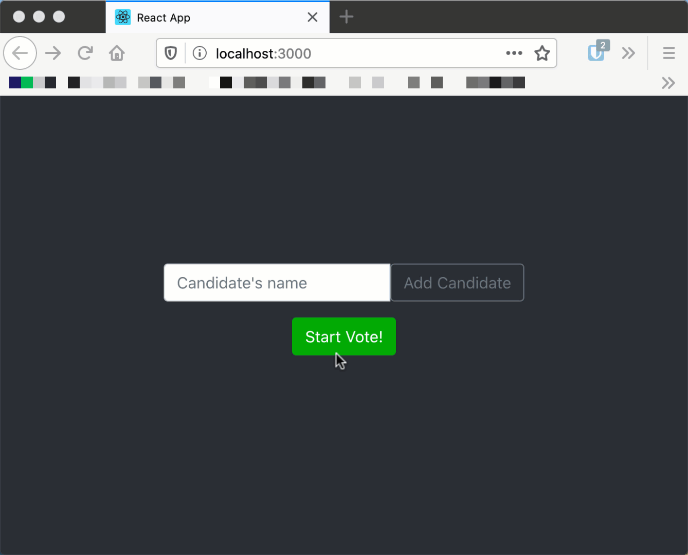

# Voting-Boot-React

# Instructions
Développez une application React pour la création d'une borne de vote. La borne de vote doit avoir les capacités suivantes:

* Ajouter des candidats avant un vote.
* Votez pour un candidat.
* Déterminer le gagnant du vote. (La gestion d'une égalité n'est **pas** nécessaire)

# Requis technique
Le projet doit au moins avoir 3 components (vous pouvez en créer plus au besoin):

* L'ajout de candidat
* La liste des candidats
* La déclaration du gagnant

# Critères d'évaluations
Le travail sera évalué sur le niveau de fonctionnalité atteint. Plusieurs paliers de fonctionnalité sont possibles. Des points seront aussi attribués pour la lisibilité du code (avoir une bonne décomposition de components et de la gestion de l'état)

## Palier 1 (MVP)
* Ajout de candidat
* Liste de candidat avec vote
* Déclaration du gagnant

Tous les éléments sont sur la même page sans transition.

## Palier 2 - Gestion des étapes
L'application est dictée en trois étapes qui limitent les informations présentées.
* Gestion des candidats
  * Affichage des candidats (nom seulement)
  * Ajout de candidat possible
* Vote
  * Affichage des candidats avec bouton de vote
* Gagnant
  * Affichage du gagnant
  * Affichage des candidats avec leurs nombres de votes

## Palier 3 - Transition & Extra (Bonus)
* L'application doit intégrer des transitions (animation) entre ses étapes.
* L'application doit faire la gestion d'une égalité dans le nombre de votes.

# Exemple du projet
